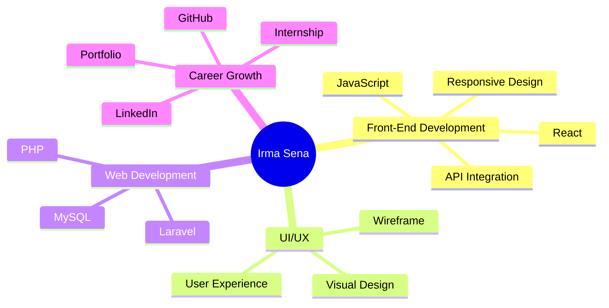
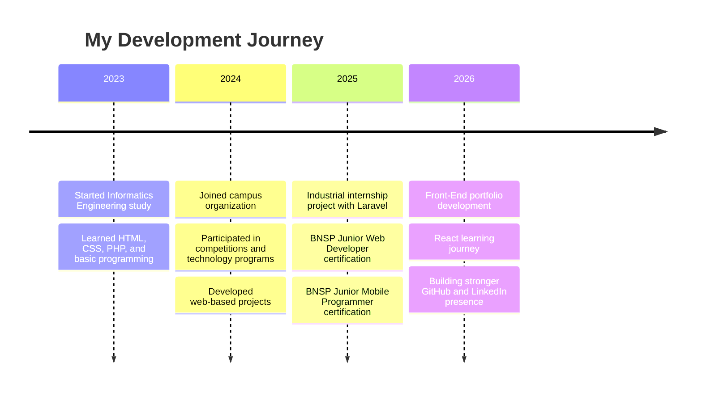

<div align="center">


<br/>

<a href="mailto:irmaashe@gmail.com">
  
</a>
<a href="https://www.linkedin.com/in/irmasenam">
  
</a>
<a href="https://github.com/IRMASENAM">
  
</a>

<br/><br/>


</div>

---

## 👩‍💻 About Me

<table>
<tr>
<td width="60%">

Hi, I'm **Irma Sena Marliyana**, an Informatics Engineering student at **Politeknik Negeri Cilacap** with a strong interest in **Front-End Development**, **UI/UX Design**, and modern web technologies.

I enjoy transforming ideas into clean, responsive, and user-friendly digital products. My learning journey focuses on building practical projects, improving interface quality, and understanding how technology can solve real problems.

</td>
<td width="40%">

```javascript
const irma = {
  role: "Front-End Developer",
  education: "D3 Informatics Engineering",
  university: "Politeknik Negeri Cilacap",
  focus: ["Frontend", "UI/UX", "Web Development"],
  learning: ["React", "API Integration", "Laravel"],
  mindset: "Keep learning, keep building 🚀"
};
```

</td>
</tr>
</table>

---

## 🎯 Current Focus



---

## ⚡ Tech Arsenal

<div align="center">

### Development


<br><br>

### Design & Productivity


<br><br>

### Currently Exploring


</div>

---

<div align="center">

| 💻 Front-End | ⚙️ Back-End | 🎨 Design | 🧰 Tools |
|:------------:|:-----------:|:----------:|:---------:|
| HTML | Laravel | Figma | Git |
| CSS | PHP | Canva | GitHub |
| JavaScript | MySQL | UI/UX | VS Code |
| React | API Integration | Responsive Design | Microsoft Office |

</div>

---

## 🏆 Certifications, Achievements & Experience

<table>
<tr>
<td width="50%">

### 📜 Certifications

- **BNSP Certified** — Junior Web Developer
- **BNSP Certified** — Junior Mobile Programmer
- Technology and self-development training certificates
- Web development and digital skill learning programs

</td>
<td width="50%">

### 🏅 Achievements

- Participant — National Polytechnic Informatics Student Competition **KMIPN VI**
- Participant — National Infographic Competition
- Participant — National Essay Competition
- Participant — PKM IoT Program
- Scientific Writing Competition participant

</td>
</tr>
<tr>
<td width="50%">

### 🏢 Organization Experience

- Administrative Staff — **BEM Politeknik Negeri Cilacap**
- Managed organizational documents
- Supported event coordination
- Maintained member databases
- Assisted administrative workflows

</td>
<td width="50%">

### 💡 Soft Skills

- Team Collaboration
- Communication
- Problem Solving
- Time Management
- Public Speaking
- Adaptability

</td>
</tr>
</table>

---

## 📈 Learning Roadmap



---

## 📊 GitHub Analytics

<div align="center">


</div>

<div align="center">


</div>

> Note: GitHub analytics cards are generated by external services. If they do not appear, refresh the page or wait a few minutes.

---

## 🌱 What I'm Improving

<div align="center">

| Area | Currently Improving |
|---|---|
| Front-End Development | React, components, state management |
| UI/UX | Layout, spacing, color harmony, accessibility |
| API Integration | Fetching data, handling responses, error states |
| Project Workflow | Git, GitHub, documentation, collaboration |
| Career Branding | Portfolio, LinkedIn, README, project presentation |

</div>

---

## 🤝 Connect With Me

<div align="center">

<a href="mailto:irmaashe@gmail.com">
  
</a>

<a href="https://www.linkedin.com/in/irmasenam">
  
</a>

<a href="https://github.com/IRMASENAM">
  
</a>

</div>

---

<div align="center">

### ✨ “Building today, improving tomorrow.”


</div>
